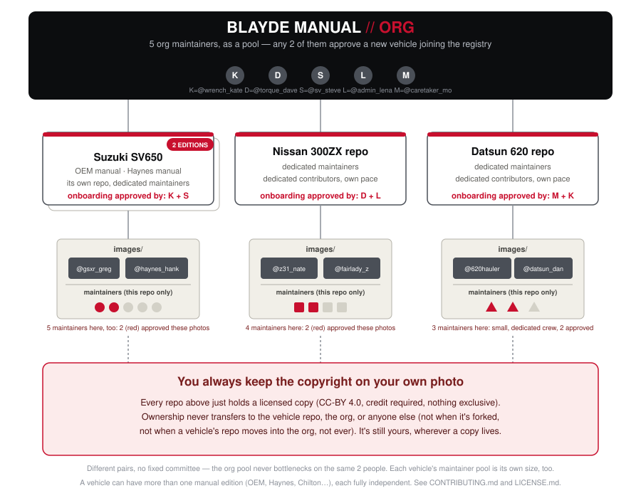

# Blayde Manual

Revives out-of-print OEM manuals with community-contributed photos,
without ever redistributing the manual's own copyrighted content --
anything with a manual: a motorcycle, a boat, a plane, a tractor, a
home appliance, a sewing machine. Pick a PDF you legally own in the
browser; it identifies structure only (page numbers, procedure
locations, figure coordinates) and publishes *that*. Photos are
contributed and patched back into your own copy of the PDF entirely
client-side -- the public repo never contains a single pixel of the
original manual.

No install, no account. Indexing and patching run entirely client-side --
identifying page structure and rendering your own patched copy never
leaves your browser. Contributing a photo the "Public" way, and indexing
a brand-new manual, do involve one server-side write each (a Worker
endpoint opens the PR or creates the private repo using its own
credential, never yours) -- see SECURITY.md for exactly what that
endpoint does and doesn't see.

Read [LEGAL.md](LEGAL.md) for the legal reasoning behind that architecture.
Read [SECURITY.md](SECURITY.md) for the trust model behind photo review
and merges. Open design questions and deferred features live in
[ROADMAP.md](ROADMAP.md). [The FAQ](https://blaydemanual.com/docs/faq.html)
answers the questions people actually ask, in plain language, no git
knowledge required.

## How this is structured

Each item gets its own repo and its own maintainer pool, covering every
edition of that item's manual (OEM, Haynes, etc. -- editions are
subdirectories, not separate repos). An item's own maintainers handle
ongoing photo review; the org above them only reviews a *new* item or
edition joining the registry. No matter which repo holds a copy of your
photo, it's still yours -- every photo is individually CC-BY 4.0 licensed
by the person who took it.



## The actual tool

Everything below lives in `web/` and runs as static pages -- no build
step, no server required beyond serving the files.

| Page | What it's for |
|---|---|
| `web/index.html` | Patch your own copy of a manual. Pick a PDF, it's identified locally and checked against the registry, then patched with whatever approved community photos exist. |
| `web/registry-browse.html` | Browse every registered item, across all six categories (Garage, Marina, Hangar, Farm, Home, Hobby), see how far along each manual is. |
| `web/contribute.html` | Contribute a photo for a specific procedure. Requires signing in with GitHub only at the point of actually submitting. |
| `web/maintainer.html` | Everything a maintainer or org reviewer does: index a brand-new item (real in-browser OCR/figure detection, no Python), review photo submissions, approve new items/editions, manage an item's maintainer team. |

To run these locally for development, serve the `web/` directory with any
static file server, e.g. `python3 -m http.server --directory web`, and
open `index.html`.

## What's still Python, and why

`mosaic.py` and `stylize.py` generate the cover-page photomosaic and
house line-art filter. Not yet ported to the browser (see ROADMAP.md) --
everything else that used to be a Python CLI pipeline (indexing, review,
patching) has been fully superseded by the browser tools above and is not
part of this repo; see CHANGELOG.md if you're looking for that history.

`scaffold/checker.py` is different: it's not a CLI tool for you to run,
it's the file every item repo's CI (`scaffold/.github/workflows/validate-photo.yml`)
runs automatically against every contributed photo -- resolution, blur,
zero non-pixel data (no EXIF, no GPS, no ICC profile, nothing but the
image itself), filename matches a real procedure, exactly one file per
PR. The `scaffold/` directory here is a local mirror of
[`BlaydeManual/vehicle-scaffold`](https://github.com/BlaydeManual/vehicle-scaffold)
(named before the category expansion to any item's manual -- still the
real template repo, not yet renamed), the real GitHub template repo
that actually gets applied to every new item's repo on approval. Its
CI check is a required GitHub branch-protection status check, so these
rules are enforced by GitHub itself on every merge, not just when a PR
goes through the review UI -- see SECURITY.md for the full trust model.

## Directory layout

```
web/            the real, shipped tool -- indexer, patcher, contributor
                and maintainer portals, registry browse, auth.js (shared
                sign-in), docs/ (faq.html and supporting diagrams) -- all
                of web/ deploys as the live site, so docs/ lives inside
                it, not at the repo root
scaffold/       template forked into every new item repo (CI workflow,
                checker.py, CONTRIBUTING.md, PR template, license)
auth-worker/    Cloudflare Worker that trades a GitHub OAuth code for a
                token, the one piece of this project with a real secret
ledgers/        who-steered-what record, alongside CHANGELOG.md
mosaic.py       cover-page photomosaic generator (still Python, see above)
stylize.py      house line-art filter (still Python, see above)
LEGAL.md        legal reasoning behind the architecture
ROADMAP.md      deferred features and open design problems
CHANGELOG.md    what changed and why, including the Python -> browser move
THIRD-PARTY-NOTICES.md   every third-party library this project uses,
                its license, and how it's loaded
```
